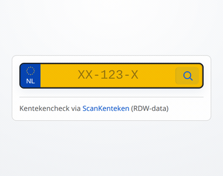

# Kenteken Check

Lightweight embed widget for inline kentekenchecks on any website. A vanilla TypeScript custom element with Shadow DOM — no framework, iframe, or scanner required.

<p align="center">
  
</p>

## Embed

```html
<script async src="https://cdn.scankenteken.nl/kenteken-check/v1/embed.js"></script>
<kenteken-check></kenteken-check>
```

## Attributes

| Attribute | Default | Values |
|---|---|---|
| `fields` | `brand,apk,link` | comma-separated: `brand`, `apk`, `price`, `euro`, `link` |
| `theme` | `auto` | `light`, `dark`, `auto` |
| `plate` | — | pre-fill and auto-lookup, e.g. `RJ-123-X` |

## Examples

Show price alongside brand and APK:

```html
<kenteken-check fields="brand,apk,price"></kenteken-check>
```

Pre-filled, dark theme:

```html
<kenteken-check plate="RJ-123-X" theme="dark"></kenteken-check>
```

## Local development

```sh
npm install
npm run build
npm run serve
```

Open the configurator to preview and copy embed code:

- http://localhost:3000/configurator/

Watch mode:

```sh
npm run dev
```

## Data source

Vehicle data is fetched from `https://api.scankenteken.nl/api/vehicles/:plate`. Rate limiting and caching are handled server-side.

## License

MIT
